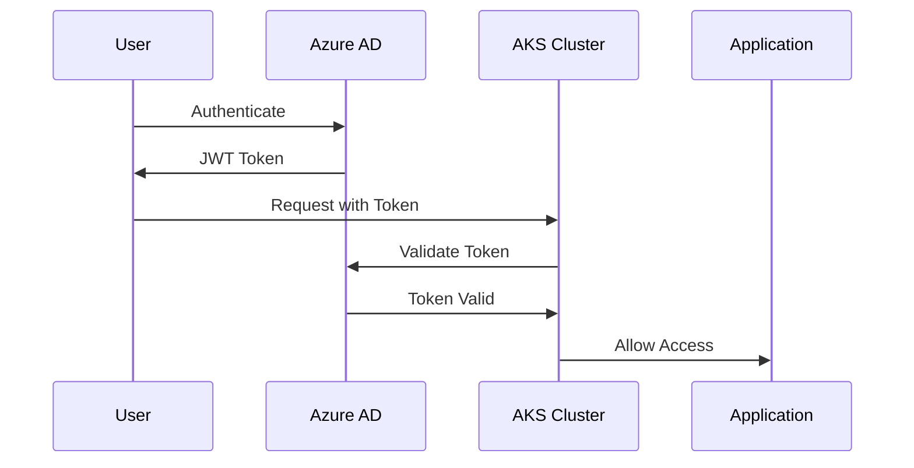
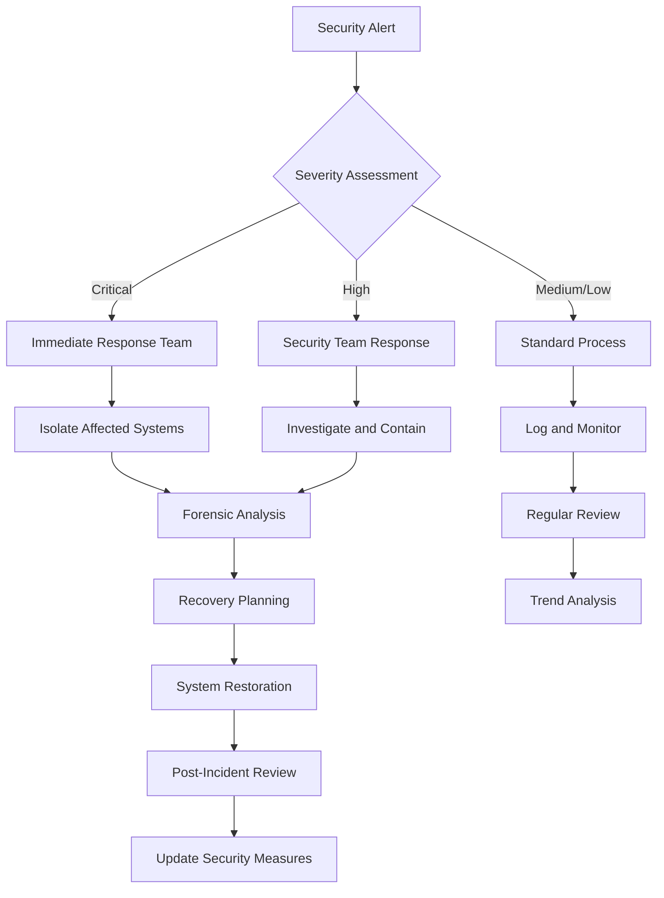

# Azure Healthcare Analytics Platform - Security Guide

## Security Overview

The Azure Healthcare Analytics Platform implements a comprehensive security framework designed to meet HIPAA compliance requirements and industry best practices. This guide covers all security aspects of the platform, from network security to data protection and compliance monitoring.

## Security Architecture Principles

### 1. Zero Trust Security Model
- **Never Trust, Always Verify**: Every request is authenticated and authorized
- **Least Privilege Access**: Users and services have minimal required permissions
- **Assume Breach**: System designed to limit blast radius if compromised
- **Continuous Verification**: Real-time security monitoring and validation

### 2. Defense in Depth
- **Multiple Security Layers**: Network, application, and data level protection
- **Redundant Controls**: Multiple security measures for critical assets
- **Fail-Safe Defaults**: Secure-by-default configuration
- **Security Automation**: Automated threat detection and response

## Network Security

### 1. Network Segmentation

#### Virtual Network Design
```
Healthcare Platform VNet (10.0.0.0/16)
├── AKS Subnet (10.0.1.0/24)
│   ├── System Nodes
│   └── Application Nodes
├── Data Subnet (10.0.2.0/24)
│   ├── Data Lake Storage
│   └── Database Services
├── Functions Subnet (10.0.3.0/24)
│   └── Azure Functions
├── API Management Subnet (10.0.4.0/24)
│   └── API Gateway
├── Gateway Subnet (10.0.5.0/24)
│   └── Application Gateway
└── Private Endpoints Subnet (10.0.6.0/24)
    └── Private Service Connections
```

#### Network Security Groups (NSGs)
```json
{
  "name": "AKS-NSG",
  "rules": [
    {
      "name": "AllowInternalCluster",
      "priority": 100,
      "direction": "Inbound",
      "access": "Allow",
      "protocol": "*",
      "sourcePortRange": "*",
      "destinationPortRange": "*",
      "sourceAddressPrefix": "10.0.1.0/24",
      "destinationAddressPrefix": "10.0.1.0/24"
    },
    {
      "name": "AllowHTTPSFromAPIM",
      "priority": 110,
      "direction": "Inbound",
      "access": "Allow",
      "protocol": "Tcp",
      "sourcePortRange": "*",
      "destinationPortRange": "443",
      "sourceAddressPrefix": "10.0.4.0/24",
      "destinationAddressPrefix": "10.0.1.0/24"
    },
    {
      "name": "DenyAllInbound",
      "priority": 4000,
      "direction": "Inbound",
      "access": "Deny",
      "protocol": "*",
      "sourcePortRange": "*",
      "destinationPortRange": "*",
      "sourceAddressPrefix": "*",
      "destinationAddressPrefix": "*"
    }
  ]
}
```

### 2. Private Connectivity

#### Private Endpoints Configuration
- **Azure Storage**: Private endpoint for Data Lake access
- **Azure Key Vault**: Private endpoint for secrets management
- **Azure Container Registry**: Private endpoint for container images
- **Azure Cosmos DB**: Private endpoint for database access

#### Service Endpoints
- **Microsoft.Storage**: For optimized storage access
- **Microsoft.KeyVault**: For Key Vault integration
- **Microsoft.Sql**: For database services
- **Microsoft.ContainerRegistry**: For ACR access

### 3. Web Application Firewall (WAF)

#### Azure Application Gateway WAF Rules
```yaml
waf_configuration:
  enabled: true
  firewall_mode: "Prevention"
  rule_set_type: "OWASP"
  rule_set_version: "3.2"
  
  disabled_rule_groups:
    - rule_group_name: "REQUEST-920-PROTOCOL-ENFORCEMENT"
      rules: [920300, 920440]
  
  exclusions:
    - match_variable: "RequestHeaderNames"
      selector: "User-Agent"
      selector_match_operator: "Equals"
```

## Identity and Access Management

### 1. Azure Active Directory Integration

#### Authentication Flow


#### Role-Based Access Control (RBAC)
```yaml
# Custom RBAC Roles
apiVersion: rbac.authorization.k8s.io/v1
kind: ClusterRole
metadata:
  name: healthcare-data-reader
rules:
- apiGroups: [""]
  resources: ["pods", "services"]
  verbs: ["get", "list", "watch"]
- apiGroups: ["apps"]
  resources: ["deployments"]
  verbs: ["get", "list", "watch"]

---
apiVersion: rbac.authorization.k8s.io/v1
kind: ClusterRole
metadata:
  name: healthcare-data-processor
rules:
- apiGroups: [""]
  resources: ["pods", "services", "configmaps", "secrets"]
  verbs: ["get", "list", "watch", "create", "update", "patch"]
- apiGroups: ["batch"]
  resources: ["jobs"]
  verbs: ["get", "list", "watch", "create", "update", "patch", "delete"]
```

### 2. Workload Identity

#### Configuration
```yaml
# Service Account with Workload Identity
apiVersion: v1
kind: ServiceAccount
metadata:
  name: healthcare-platform-sa
  namespace: healthcare-platform
  annotations:
    azure.workload.identity/client-id: "xxxxxxxx-xxxx-xxxx-xxxx-xxxxxxxxxxxx"
    azure.workload.identity/tenant-id: "xxxxxxxx-xxxx-xxxx-xxxx-xxxxxxxxxxxx"

---
# Federated Identity Credential
resource "azurerm_federated_identity_credential" "workload" {
  name                = "healthcare-platform-federated-identity"
  resource_group_name = var.resource_group_name
  audience            = ["api://AzureADTokenExchange"]
  issuer              = azurerm_kubernetes_cluster.main.oidc_issuer_url
  parent_id           = azurerm_user_assigned_identity.workload.id
  subject             = "system:serviceaccount:healthcare-platform:healthcare-platform-sa"
}
```

## Data Protection

### 1. Encryption

#### Encryption at Rest
- **Customer-Managed Keys (CMK)**: Stored in Azure Key Vault
- **Storage Account Encryption**: Using CMK for Data Lake
- **Database Encryption**: TDE with CMK for Cosmos DB
- **Key Rotation**: Automated 90-day rotation policy

```terraform
# Customer-Managed Key Configuration
resource "azurerm_key_vault_key" "encryption" {
  name         = "healthcare-platform-cmk"
  key_vault_id = azurerm_key_vault.main.id
  key_type     = "RSA"
  key_size     = 2048

  key_opts = [
    "decrypt",
    "encrypt",
    "sign",
    "unwrapKey",
    "verify",
    "wrapKey",
  ]

  rotation_policy {
    automatic {
      time_before_expiry = "P30D"
    }
    expire_after         = "P90D"
    notify_before_expiry = "P29D"
  }
}
```

#### Encryption in Transit
- **TLS 1.3**: For all HTTPS communications
- **mTLS**: For service-to-service communication
- **VPN/ExpressRoute**: For on-premises connectivity

### 2. Data Classification and Masking

#### PHI Detection Algorithm
```python
import re
from typing import Dict, List, Any

class PHIDetector:
    """HIPAA-compliant PHI detection and masking"""
    
    def __init__(self):
        self.patterns = {
            'ssn': re.compile(r'\b\d{3}-\d{2}-\d{4}\b'),
            'phone': re.compile(r'\b\d{3}-\d{3}-\d{4}\b'),
            'email': re.compile(r'\b[A-Za-z0-9._%+-]+@[A-Za-z0-9.-]+\.[A-Z|a-z]{2,}\b'),
            'credit_card': re.compile(r'\b\d{4}[-\s]?\d{4}[-\s]?\d{4}[-\s]?\d{4}\b'),
            'mrn': re.compile(r'\bMRN[:\s]*\d{6,}\b', re.IGNORECASE)
        }
    
    def detect_phi(self, text: str) -> Dict[str, List[str]]:
        """Detect PHI in text"""
        findings = {}
        
        for phi_type, pattern in self.patterns.items():
            matches = pattern.findall(text)
            if matches:
                findings[phi_type] = matches
        
        return findings
    
    def mask_phi(self, text: str) -> str:
        """Mask detected PHI"""
        masked_text = text
        
        for phi_type, pattern in self.patterns.items():
            if phi_type == 'ssn':
                masked_text = pattern.sub('XXX-XX-****', masked_text)
            elif phi_type == 'phone':
                masked_text = pattern.sub('XXX-XXX-****', masked_text)
            elif phi_type == 'email':
                masked_text = pattern.sub('***@***.***', masked_text)
            else:
                masked_text = pattern.sub('***MASKED***', masked_text)
        
        return masked_text
```

### 3. Key Management

#### Azure Key Vault Security
```json
{
  "access_policies": [
    {
      "tenant_id": "xxxxxxxx-xxxx-xxxx-xxxx-xxxxxxxxxxxx",
      "object_id": "xxxxxxxx-xxxx-xxxx-xxxx-xxxxxxxxxxxx",
      "key_permissions": [
        "Get", "List", "Update", "Create", "Import", "Delete", 
        "Recover", "Backup", "Restore", "Decrypt", "Encrypt", 
        "UnwrapKey", "WrapKey", "Verify", "Sign"
      ],
      "secret_permissions": [
        "Get", "List", "Set", "Delete", "Recover", "Backup", "Restore"
      ],
      "certificate_permissions": [
        "Get", "List", "Update", "Create", "Import", "Delete", 
        "Recover", "Backup", "Restore", "ManageContacts", 
        "ManageIssuers", "GetIssuers", "ListIssuers", 
        "SetIssuers", "DeleteIssuers"
      ]
    }
  ],
  "network_acls": {
    "default_action": "Deny",
    "bypass": "AzureServices",
    "virtual_network_subnet_ids": [
      "/subscriptions/.../subnets/aks-subnet",
      "/subscriptions/.../subnets/functions-subnet"
    ]
  }
}
```

## Application Security

### 1. Container Security

#### Security Context Configuration
```yaml
# Pod Security Context
apiVersion: v1
kind: Pod
spec:
  securityContext:
    runAsNonRoot: true
    runAsUser: 1000
    runAsGroup: 3000
    fsGroup: 2000
    seccompProfile:
      type: RuntimeDefault
  containers:
  - name: data-processor
    securityContext:
      allowPrivilegeEscalation: false
      capabilities:
        drop:
          - ALL
      readOnlyRootFilesystem: true
      runAsNonRoot: true
      runAsUser: 1000
```

#### Container Image Scanning
```yaml
# Trivy Security Scan
name: Container Security Scan
on:
  push:
    branches: [main]
  pull_request:
    branches: [main]

jobs:
  scan:
    runs-on: ubuntu-latest
    steps:
      - name: Checkout code
        uses: actions/checkout@v4
      
      - name: Build image
        run: docker build -t test-image .
      
      - name: Run Trivy vulnerability scanner
        uses: aquasecurity/trivy-action@master
        with:
          image-ref: 'test-image'
          format: 'sarif'
          output: 'trivy-results.sarif'
      
      - name: Upload scan results
        uses: github/codeql-action/upload-sarif@v2
        with:
          sarif_file: 'trivy-results.sarif'
```

### 2. Network Policies

#### Kubernetes Network Policies
```yaml
# Deny all ingress by default
apiVersion: networking.k8s.io/v1
kind: NetworkPolicy
metadata:
  name: default-deny-ingress
  namespace: healthcare-platform
spec:
  podSelector: {}
  policyTypes:
  - Ingress

---
# Allow ingress from ingress controller
apiVersion: networking.k8s.io/v1
kind: NetworkPolicy
metadata:
  name: allow-ingress-controller
  namespace: healthcare-platform
spec:
  podSelector:
    matchLabels:
      app.kubernetes.io/component: api-gateway
  policyTypes:
  - Ingress
  ingress:
  - from:
    - namespaceSelector:
        matchLabels:
          name: ingress-nginx
    ports:
    - protocol: TCP
      port: 8080

---
# Allow internal service communication
apiVersion: networking.k8s.io/v1
kind: NetworkPolicy
metadata:
  name: allow-internal-services
  namespace: healthcare-platform
spec:
  podSelector: {}
  policyTypes:
  - Ingress
  - Egress
  ingress:
  - from:
    - podSelector: {}
  egress:
  - to:
    - podSelector: {}
  - to: []
    ports:
    - protocol: TCP
      port: 53
    - protocol: UDP
      port: 53
    - protocol: TCP
      port: 443
```

### 3. Secrets Management

#### Kubernetes Secrets Best Practices
```yaml
# External Secrets Operator Configuration
apiVersion: external-secrets.io/v1beta1
kind: SecretStore
metadata:
  name: azure-keyvault-store
  namespace: healthcare-platform
spec:
  provider:
    azurekv:
      authType: WorkloadIdentity
      vaultUrl: "https://healthcare-kv.vault.azure.net/"
      serviceAccountRef:
        name: healthcare-platform-sa

---
apiVersion: external-secrets.io/v1beta1
kind: ExternalSecret
metadata:
  name: healthcare-secrets
  namespace: healthcare-platform
spec:
  refreshInterval: 15s
  secretStoreRef:
    name: azure-keyvault-store
    kind: SecretStore
  target:
    name: healthcare-platform-secrets
    creationPolicy: Owner
  data:
  - secretKey: storage-connection-string
    remoteRef:
      key: storage-connection-string
  - secretKey: database-password
    remoteRef:
      key: database-admin-password
```

## Compliance and Auditing

### 1. HIPAA Compliance

#### Required Controls
- **Access Control**: Unique user identification, automatic logoff, encryption/decryption
- **Audit Controls**: Hardware, software, and procedural mechanisms for recording access
- **Integrity**: PHI must not be improperly altered or destroyed
- **Person or Entity Authentication**: Verify identity before access
- **Transmission Security**: Guard against unauthorized access during transmission

#### Compliance Monitoring
```python
class HIPAAComplianceMonitor:
    """Monitor HIPAA compliance requirements"""
    
    def __init__(self):
        self.audit_logger = AuditLogger()
        self.access_monitor = AccessMonitor()
    
    def log_phi_access(self, user_id: str, resource: str, action: str):
        """Log PHI access for HIPAA audit trail"""
        audit_event = {
            'timestamp': datetime.utcnow().isoformat(),
            'user_id': user_id,
            'resource': resource,
            'action': action,
            'ip_address': self.get_client_ip(),
            'user_agent': self.get_user_agent(),
            'session_id': self.get_session_id(),
            'compliance_framework': 'HIPAA'
        }
        
        self.audit_logger.log(audit_event)
    
    def validate_access_controls(self):
        """Validate access control requirements"""
        # Check user authentication
        # Verify encryption status
        # Validate access permissions
        # Check session timeouts
        pass
    
    def generate_audit_report(self, start_date: str, end_date: str):
        """Generate HIPAA compliance audit report"""
        return self.audit_logger.generate_report(start_date, end_date)
```

### 2. Audit Logging

#### Comprehensive Audit Trail
```yaml
# Fluent Bit Configuration for Audit Logging
apiVersion: v1
kind: ConfigMap
metadata:
  name: fluent-bit-config
data:
  fluent-bit.conf: |
    [SERVICE]
        Flush         1
        Log_Level     info
        Daemon        off
        Parsers_File  parsers.conf
        HTTP_Server   On
        HTTP_Listen   0.0.0.0
        HTTP_Port     2020

    [INPUT]
        Name              tail
        Path              /var/log/containers/*healthcare-platform*.log
        Parser            docker
        Tag               healthcare.*
        Refresh_Interval  5
        Mem_Buf_Limit     50MB

    [FILTER]
        Name    kubernetes
        Match   healthcare.*
        Labels  On
        Annotations On

    [FILTER]
        Name    modify
        Match   healthcare.*
        Add     compliance_framework HIPAA
        Add     log_type audit

    [OUTPUT]
        Name  azure
        Match healthcare.*
        Customer_ID ${WORKSPACE_ID}
        Shared_Key  ${WORKSPACE_KEY}
        Log_Type    healthcare_audit
```

### 3. Security Monitoring

#### Real-time Security Alerts
```yaml
# Prometheus Alert Rules
groups:
- name: healthcare.security
  rules:
  - alert: UnauthorizedAccess
    expr: increase(nginx_ingress_controller_requests_total{status=~"4.."}[5m]) > 10
    for: 1m
    labels:
      severity: critical
      compliance: HIPAA
    annotations:
      summary: "High number of unauthorized access attempts"
      description: "{{ $value }} unauthorized access attempts in the last 5 minutes"

  - alert: PHIAccessOutsideHours
    expr: healthcare_phi_access_total and hour() < 8 or hour() > 18
    for: 0m
    labels:
      severity: warning
      compliance: HIPAA
    annotations:
      summary: "PHI accessed outside business hours"
      description: "PHI access detected outside of normal business hours"

  - alert: DataExfiltrationAttempt
    expr: rate(healthcare_data_export_bytes_total[5m]) > 1000000
    for: 2m
    labels:
      severity: critical
      compliance: HIPAA
    annotations:
      summary: "Potential data exfiltration detected"
      description: "Large amount of data being exported: {{ $value }} bytes/sec"
```

## Security Operations

### 1. Incident Response

#### Security Incident Response Plan


#### Automated Response Actions
```python
class SecurityIncidentHandler:
    """Automated security incident response"""
    
    def __init__(self):
        self.alert_manager = AlertManager()
        self.isolation_service = IsolationService()
        self.notification_service = NotificationService()
    
    def handle_critical_alert(self, alert):
        """Handle critical security alerts"""
        # Immediate isolation
        if alert.type == 'data_exfiltration':
            self.isolation_service.block_user(alert.user_id)
            self.isolation_service.quarantine_pod(alert.pod_name)
        
        # Notify security team
        self.notification_service.send_urgent_alert(
            channel='security-team',
            message=f"Critical security incident: {alert.description}",
            alert=alert
        )
        
        # Start forensic data collection
        self.start_forensic_collection(alert)
    
    def start_forensic_collection(self, alert):
        """Collect forensic data for investigation"""
        # Capture pod logs
        # Export network flow data
        # Preserve audit trails
        # Create incident timeline
        pass
```

### 2. Vulnerability Management

#### Automated Security Scanning
```yaml
# Scheduled Security Scans
apiVersion: batch/v1
kind: CronJob
metadata:
  name: security-scan
  namespace: healthcare-platform
spec:
  schedule: "0 2 * * *"  # Daily at 2 AM
  jobTemplate:
    spec:
      template:
        spec:
          containers:
          - name: security-scanner
            image: aquasec/trivy:latest
            command:
            - /bin/sh
            - -c
            - |
              # Scan all images in namespace
              kubectl get pods -o jsonpath='{.items[*].spec.containers[*].image}' | \
              xargs -n1 trivy image --format json --output /reports/scan-$(date +%Y%m%d).json
            volumeMounts:
            - name: scan-reports
              mountPath: /reports
          volumes:
          - name: scan-reports
            persistentVolumeClaim:
              claimName: security-scan-reports
          restartPolicy: OnFailure
```

### 3. Security Training and Awareness

#### Security Best Practices for Development Teams

1. **Secure Coding Practices**
   - Input validation and sanitization
   - Proper error handling
   - Secure authentication implementation
   - Regular security code reviews

2. **Container Security**
   - Use minimal base images
   - Regular image updates
   - Scan for vulnerabilities
   - Implement proper secrets management

3. **Kubernetes Security**
   - Apply principle of least privilege
   - Use network policies
   - Implement pod security standards
   - Regular security audits

4. **Data Handling**
   - Encrypt sensitive data
   - Implement proper access controls
   - Regular data classification reviews
   - Secure data disposal

This security guide provides comprehensive coverage of all security aspects of the Azure Healthcare Analytics Platform, ensuring HIPAA compliance and industry best practices are followed throughout the deployment and operation of the system.
